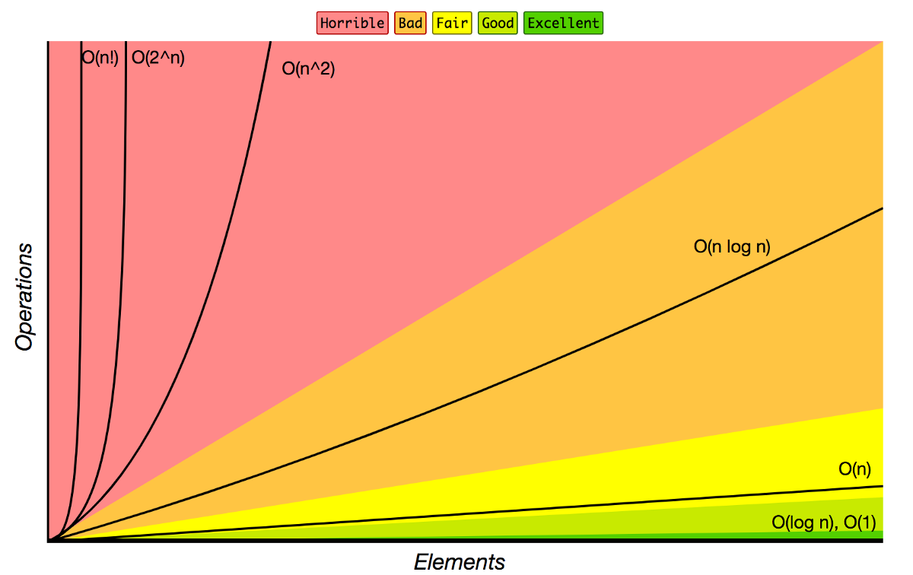

# Big O Notation

## What
* Compare the performance of two or more algorithms numerically.

## An example

Consider a problem to find the sum of all numbers upto a given number n;
Here are two ways to do that:

1. Using a for loop:
```javascript
function addToSum(num) {
    let sum = 0;
    for (let i = 1; i <= num; i++) {
        sum += i;
    }
    return sum;
}
```
2. Using math formula:
```javascript
function addToSumFast(num) {
    return num * (num + 1) / 2;
}
```

If we compare the time required to compute the sum of first billion digits, we find that the second algorithm is about 100 times faster. But time taken for execution is not a very good measure to compare two algorithms as:

1. _Time of execution varies_ from machine to machine and even execution to execution on the same machine.
2. When _comparing two similarly performing algorithms_, the absolute time of execution may not be able to determine the faster algorithm due to lack of precesion.

## A Solution:

Instead of counting time of execution, what if we count the number of operations. But do we mean by an operaion? Operations include the following:

1. Mathematical Operations: +, *, -, /, % 
2. Comparisions: ==, <=, >=, ===
3. Assignment: let i = 5, a = 4

In the math formula version of our code, for any input size of num, we perform 3 operations. On the other hand in the for loop code, the number of operations we perform depends linearly on n (4n + 1).

So we can say that the number of operations in the for loop algorithm is _proportional to n_ and in the math algorithm is _proportional to a constant_.

> Project Idea: Make a js tool that takes in a function as input and plots its time vs n curve

## Definition:
The Big O notation allows us to formally talk about the performance of an algorithm.
> Big O : The Big O of an algorithm is **O(f(n))** if the number of operations involved in the algorithm is of the order of some multiple of f(n) as n grows.

Thus the big O of the for loop example above is **O(n)**
and for the math formula is **O(1)**

### Thumb Rules:
1. Constants don't matter: O(4n + 6) => O(n)
2. Smaller quantities don't matter: O(4n<sup>2</sup> + 3n + 2)=> O(n<sup>2</sup>)
3. Analyse the trend as n approaches infinity

---

## Space Complexity

Time complexity indicates how much time program takes. Similarly, space complexity indicates how much space a program takes. While estimating the time complexity of an algorithm, we considered the number of operations. Here, while calculating the space complexity, we will consider the number of _declarations_:

1. Declaring primitive datatypes takes constant space:
```javascript
// All have O(1) space
let i = 0;
const a = null;
var isHappy = true;
```
2. Strings, Arrays, Sets etc. take linear space proportional to their size:
```javascript
// All have O(n) space
let arr = [1, 2, 3, 4, 5];
const word = "Hello World!";
```

_The same thumb rules apply as the ones for time complexity._

## Examples:

1. O(1):
```javascript
function sum(array) {
    let total = 0; //first declaration
    for (const num of array) { //second declaration
        total += num;
    }
    return total
}
```
Note: In the for of loop, ```num``` is declared only once but assigned multiple number of times

2. O(n):
```javascript
function doubleArray(array){
    let doubleArray = [];
    for(const num of array){
        doubleArray.push(2*num);
    }
    return doubleArray;
}
```
Since we declare an array here, the space complexity depends linearly with its length. Hence the space complexity here is O(n) or O(array.length)

## Review
Time complexity counts number of *Operations*
Space complexity counts number of *Declarations*
 
